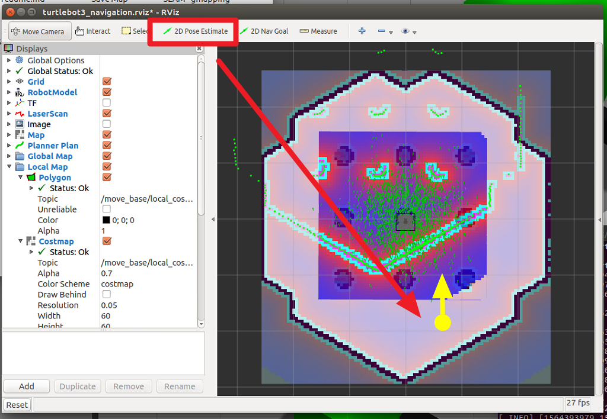
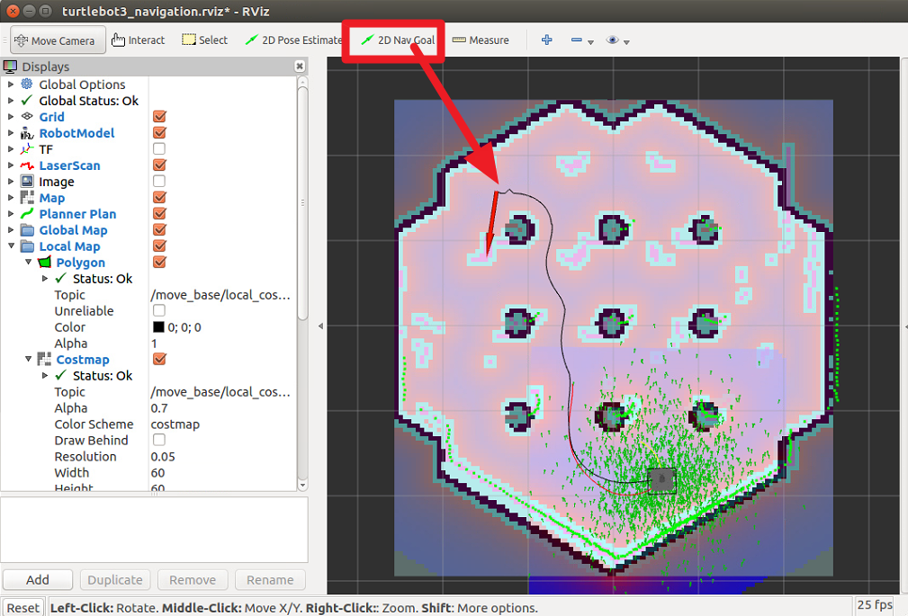
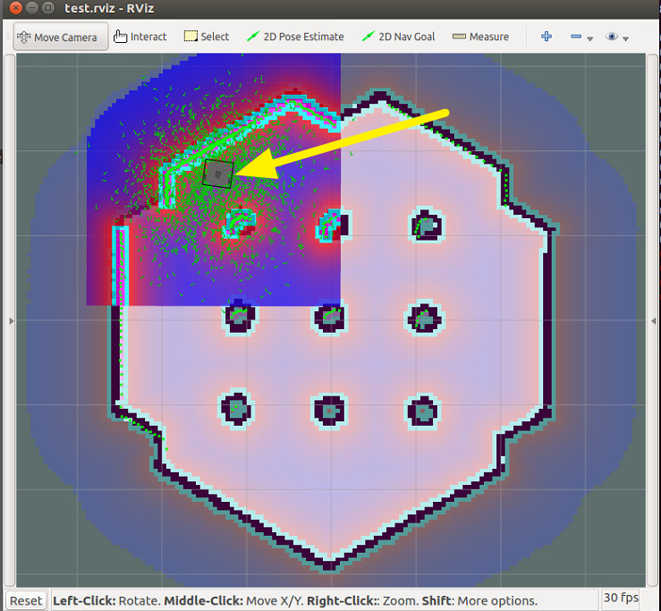
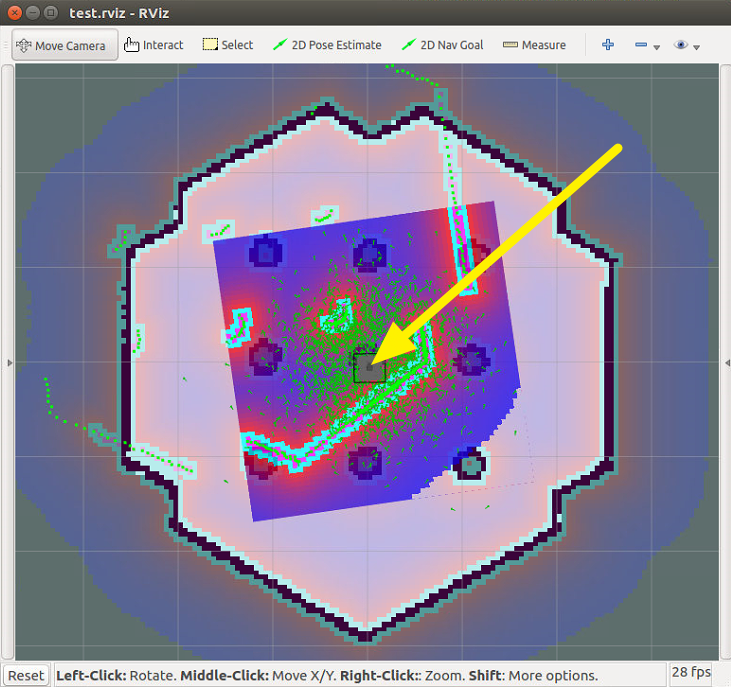

# pose_recovery_pkg

[TOC]

## 0 相依的pkg

要先安裝才能正常使用

```shell
sudo apt install ros-kinetic-turtlebot3-gazebo
sudo apt install ros-kinetic-turtlebot3-navigation
```


## 1 Example

```shell
# 第一次啟動
roscore
roslaunch turtlebot3_gazebo turtlebot3_world.launch
roslaunch pose_recovery_pkg pose_recovery_pkg.launch
roslaunch turtlebot3_navigation turtlebot3_navigation.launch
```

使用2D Pose Estimate告訴導航程序當前機器人的大致位置後隨意走動。





```shell
# 關閉( Ctrl+C ) turtlebot3_navigation 後再重啟位置會自動恢復
roslaunch turtlebot3_navigation turtlebot3_navigation.launch
```




如果**沒有啟動**pose_recovery_pkg，重啟turtlebot3_navigation看起來可能會像下圖這樣，必須手動使用2D Pose Estimate告訴定位系統實際位置才能繼續導航。



## 2 Nodes

### 2.1 pose_recovery_node

可以紀錄當前位置並且在定位系統剛開啟時，將最後紀錄的位置告訴定位系統。

不必在rviz上手動給出 2D Pose Estimate。

### 2.1.1 訂閱的話題

/tf ([tf2_msgs/TFMessage](http://docs.ros.org/jade/api/tf2_msgs/html/msg/TFMessage.html))

- 標準的TF訊息

### 2.1.2 發佈的話題

~initialpose([geometry_msgs/PoseWithCovarianceStamped](http://docs.ros.org/melodic/api/geometry_msgs/html/msg/PoseWithCovarianceStamped.html))

- 定位系統需要的初始化的位置

### 2.1.3 參數

```shell
rosrun rqt_reconfigure rqt_reconfigure
```


~map_frame_id(`string`, default: "map")

- 地圖座標的名稱

~base_frame_id(`string`, default: "base_link")

- 機器人基礎座標的名稱

~file_name(`string`, default: "base_link")

- 檔案保存的名稱，roslaunch時保存路徑在~/.ros，rosrun時保存路徑在執行指令的終端機目錄

~period(`float`, default: "0.5")

- 保存的週期 單位秒

~file_buffer(`int`, default: "2")

- 為了避免寫檔沒有完成時就斷電造成壞檔，所以會交替的寫檔。

~covariance_x (`float`, default: "0.25")

~covariance_y (`float`, default: "0.25")

~covariance_theta (`float`, default: "40.0")

- initialpose 訊息中姿態的斜方差，單位是公尺與deg

~initial (`bool`, default)

- (測試功能) 重新發出原地的位置估測訊息